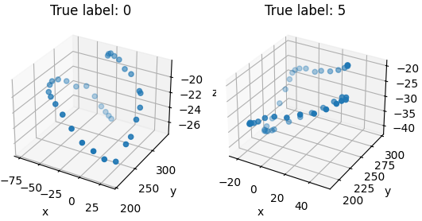
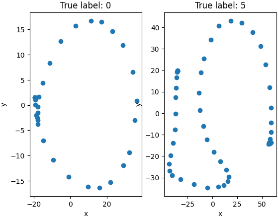
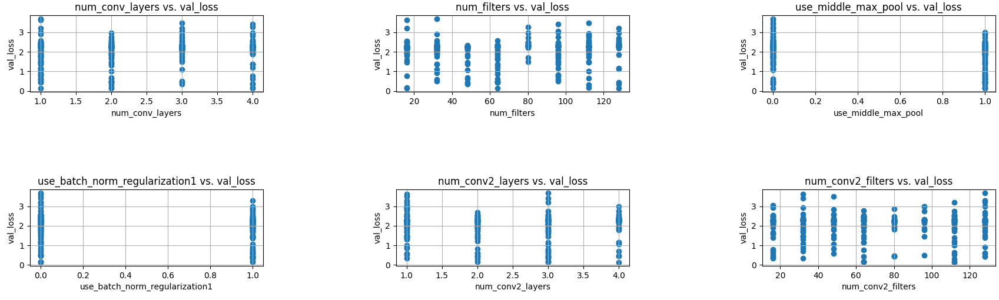
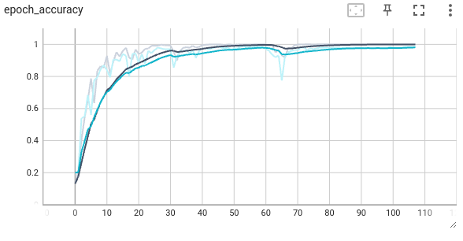

# Classifying 3D coordinate sequences of hand drawn digits

This was a school project, where we received 1000 different length 3D coordinate sequences of hand drawn digits. The goal was to classify the digits into 10 different classes (0-9). Our team received the highest score (98.3% accuracy) in the class, since it's beginning in 2016.

*Figure 1: Examples of the 3D coordinate sequences of hand drawn digits.*

Since characters are inherently 2D, we projected the 3D coordinates using PCA to 2D. NOTE: We did not use these 2D coordinates for classification, but only for visualization purposes.

To make the dimensions match, we padded the sequences with zeros to the length of the longest sequence in the training data (222).

As our model, we used a convolutional neural network, and did a large hyperparameter optimization with the Hyperband algorithm from the Kerastuner library.

*Figure 2: Correlation between the hyperparameters and the accuracy of the model.*

## Results
Our best model reached an accuracy of 99.5% on our own test set, and 98.3% on the test set provided by the course staff.

*Figure 3: Accuracy of the model on the training and validation set during training.*

*Figure 4: The evolution of the distribution of the weights of the first convolutional layer kernel during training.*