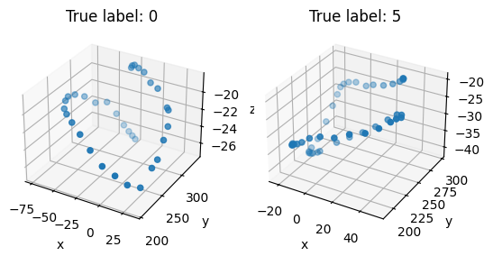

## Digit recognition from LeapSensor 3D coordinate data
In this school project our task was to classify which digit does a sequence of 3D coordinates represent. Each user who contributed, was instructed to draw a random digit (0-9) in a cube space where the position of the tip of the finger was monitored. The length of the sequence varied from 10-222 coordinates.

*Visualization of the data*

#### Approach
As our approach, we used a convolutional neural network model with a large hyperparameter search which we did using the [Keras Tuner](https://keras-team.github.io/keras-tuner/) library and it's HyperBand algorithm.
To make the dimensions work, we appended zero coordinates to the end of the sequences that were shorter than the longest sequence. 

#### Pipeline
As our pipeline, we split the data 60/20/20 to train, validation and test sets. We performed the hyperparameter search using the training set and testing performance of the validation set. After the hyperparameter search, we trained the best model architecture using both the training and validation sets, while validating the performance on the test set.

#### Results
Our results were very good, **ranking 1st** in the classification task since it's launch in 2016. The accuracy of our model on the test set was 99.5% with a log loss of 0.06. Each model was additionally evaluated on a secret test set, where our model had an accuracy of 98.4%.